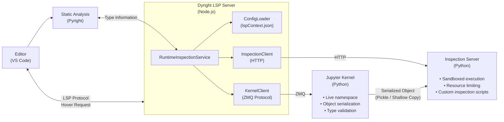

# Dyright: Runtime-Augmented Static Type Analysis for Jupyter Notebooks

**Authors:** Atiya Alkhodari
**Repository:** https://github.com/Atiyakh/dyright

---

## Summary

Dyright extends Microsoft's Pyright static type checker with controlled runtime inspection capabilities specifically designed for Jupyter notebook environments. By combining static type inference with dynamic introspection of live kernel objects, Dyright provides developers with richer hover information that reflects the actual state of variables during interactive data science workflows. This hybrid approach addresses a fundamental limitation of purely static analysis tools when applied to the exploratory, iterative nature of notebook-based programming.

## Statement of Need

Static type checkers like Pyright, mypy, and Pylance have become essential tools in the Python ecosystem, catching type errors before runtime and providing intelligent code completion. However, in Jupyter notebook environments, these tools face a fundamental challenge: **the disconnect between static analysis and runtime reality**.

Consider a data scientist working with a pandas DataFrame:

```python
df = pd.read_csv("sales_data.csv")  # Columns unknown at static analysis time
df_filtered = df[df["revenue"] > 1000]  # Is "revenue" a valid column?
```

A static type checker can determine that `df` is of type `pandas.DataFrame`, but cannot know:
- The actual column names present in the data
- The shape of the DataFrame (rows × columns)
- Memory consumption
- Data types of individual columns
- Statistical properties of the data

This information gap is particularly problematic in notebook environments where:
1. Data is loaded dynamically from external sources
2. Transformations are applied iteratively
3. The "ground truth" exists only in the running kernel
4. Developers frequently hover over variables to understand their current state

Dyright addresses this need by augmenting static type information with controlled runtime inspection, providing a unified hover experience that combines type-theoretic guarantees with empirical runtime data.

### Platform and Dependency Clarification

Dyright does **not** require any proprietary Microsoft platforms or services.

While Dyright extends and integrates with **Pyright**, an open-source static type checker originally developed by Microsoft, Pyright itself is licensed under the MIT license and runs locally. Dyright does not depend on Microsoft cloud services, Microsoft accounts, or proprietary tooling.

Dyright operates entirely on:
- Local CPython runtimes
- Standard Jupyter kernels (ipykernel)
- Open-source libraries (e.g., Pyright, ZeroMQ, aiohttp)

Supported operating systems include Linux, macOS, and Windows—any platform capable of running Python and Jupyter. All runtime inspection occurs locally and no data is transmitted externally.

## Architecture

### System Overview

Dyright employs a multi-process architecture that maintains strict separation between the language server, the Jupyter kernel, and the inspection sandbox. This design prioritizes safety, ensuring that inspection operations cannot corrupt kernel state or cause resource exhaustion.




**Figure 1:** Dyright system architecture showing the separation between static analysis, kernel communication, and sandboxed inspection.

### Component Descriptions

#### 1. Configuration Layer

**File:** [`runtimeInspection/configLoader.ts`](packages/pyright-internal/src/runtimeInspection/configLoader.ts)

The configuration layer manages the `lspContext.json` file, which defines inspection policies for different types. This design decision—using a declarative configuration file rather than hardcoded inspection logic—provides several benefits:

1. **User Control:** Developers can customize which types are inspected and with what resource limits
2. **Safety Boundaries:** Per-type size limits prevent inspection of unexpectedly large objects
3. **Extensibility:** New type inspections can be added without modifying core code

The configuration schema is defined in [`runtimeInspection/types.ts`](packages/pyright-internal/src/runtimeInspection/types.ts):

```typescript
interface LspContextConfig {
    enabled: boolean;
    debug?: boolean;
    kernel: KernelConfig;
    inspectionServer: InspectionServerConfig;
    typeInspections: Record<string, TypeInspectionConfig>;
}

interface TypeInspectionConfig {
    maxSizeMb: number;           // Maximum object size for inspection
    timeoutMs: number;           // Operation timeout
    copyStrategy: CopyStrategy;  // How to serialize the object
    inspectionCode: string;      // Path to inspection script
    resourceLimits: ResourceLimits;
}
```

**Design Trade-off:** We chose to require explicit opt-in for each type rather than inspecting all objects automatically. This conservative approach:
- **Pro:** Prevents unexpected resource consumption and maintains predictable performance
- **Pro:** Gives users explicit control over what data leaves the kernel
- **Con:** Requires initial configuration effort
- **Con:** New types require configuration updates

#### 2. Kernel Communication Layer

**File:** [`runtimeInspection/kernelClient.ts`](packages/pyright-internal/src/runtimeInspection/kernelClient.ts)

The kernel client implements the Jupyter messaging protocol over ZeroMQ sockets to communicate with the running IPython kernel. This is the same protocol used by Jupyter frontends, ensuring compatibility with standard Jupyter installations.

**Key Operations:**

| Operation | Purpose | Implementation |
|-----------|---------|----------------|
| `validateType()` | Verify object exists and matches expected type | Shell channel execute_request |
| `estimateSize()` | Check object size before serialization | `sys.getsizeof()` with recursion |
| `serializeObject()` | Create transferable representation | Configurable: shallow copy, deep copy, or pickle |

**Protocol Implementation:**

```typescript
// Simplified message flow for type validation
async validateType(expression: string, timeoutMs: number): Promise<KernelTypeValidationResult> {
    const code = `
import sys
try:
    _obj = ${expression}
    _result = {
        "exists": True,
        "type": type(_obj).__module__ + "." + type(_obj).__name__,
        "repr": repr(_obj)[:200]
    }
except NameError:
    _result = {"exists": False, "error": "Variable not defined"}
print(__import__('json').dumps(_result))
    `;
    
    const response = await this.execute(code, timeoutMs);
    return JSON.parse(response.stdout);
}
```

**Design Trade-off:** ZeroMQ Dependency

We made ZeroMQ an optional dependency with graceful fallback:

```typescript
// Conditional ZMQ loading with fallback
let zmq: typeof import('zeromq') | undefined;
try {
    zmq = require('zeromq');
} catch {
    // ZMQ not available - kernel features disabled
}
```

- **Pro:** Users without ZMQ can still use static analysis features
- **Pro:** Simplifies installation in environments where native modules are problematic
- **Con:** Full functionality requires additional setup
- **Con:** Mock fallback limits testing capabilities

#### 3. Object Serialization Strategy

**File:** [`runtimeInspection/kernelClient.ts`](packages/pyright-internal/src/runtimeInspection/kernelClient.ts) (lines 350-420)

A critical design decision is how to transfer objects from the kernel to the inspection server. We implement three strategies:

| Strategy | Description | Use Case | Risk Level |
|----------|-------------|----------|------------|
| `shallow` | Copy only top-level structure | DataFrames, arrays | Low |
| `deep` | Full recursive copy | Nested structures | Medium |
| `pickle` | Python pickle serialization | Complex objects | Higher |

**Shallow Copy Implementation (Default):**

```python
def shallow_copy_dataframe(df):
    """Create inspection-safe copy of DataFrame."""
    return pd.DataFrame({
        col: df[col].head(1000).copy() 
        for col in df.columns[:50]  # Limit columns
    })
```

**Rationale:** Shallow copying with truncation provides:
1. **Memory Safety:** Bounded memory consumption regardless of source object size
2. **Kernel Isolation:** Modifications to the copy cannot affect the original
3. **Representative Data:** Sufficient information for meaningful inspection

**Design Trade-off:** We chose shallow copy as the default over deep copy or direct reference:

- **Pro:** Prevents memory exhaustion on large objects
- **Pro:** Guarantees kernel state isolation
- **Con:** May miss information in nested structures
- **Con:** Statistical summaries computed on truncated data may not be fully representative

#### 4. Inspection Server

**File:** [`runtimeInspection/python/inspection_server.py`](packages/pyright-internal/src/runtimeInspection/python/inspection_server.py)

The inspection server is a separate Python process that receives serialized objects and executes type-specific inspection scripts. This architectural decision provides:

1. **Process Isolation:** Inspection crashes cannot affect the kernel
2. **Resource Control:** CPU and memory limits can be enforced at the process level
3. **Security Boundary:** Inspection code runs with reduced privileges

**Server Implementation:**

```python
class InspectionServer:
    def __init__(self, host: str, port: int, config: Dict[str, Any]):
        self.app = web.Application()
        self.registry = InspectionRegistry()
        self.resource_limiter = ResourceLimiter(
            max_ram_mb=config.get('maxRamMb', 512),
            max_cpu_percent=config.get('maxCpuPercent', 50)
        )
        
    async def handle_inspect(self, request: web.Request) -> web.Response:
        data = await request.json()
        
        # Deserialize the object
        obj = self._deserialize(data['payload'], data['format'])
        
        # Get the appropriate inspection script
        script = self.registry.get_script(data['type'])
        
        # Execute with resource limits
        with self.resource_limiter:
            result = script.inspect(obj)
            
        return web.json_response({'result': result})
```

**Type-Specific Inspection Scripts:**

Located in [`runtimeInspection/python/inspection_scripts/`](packages/pyright-internal/src/runtimeInspection/python/inspection_scripts/), these scripts implement the `inspect(obj) -> str` interface:

**DataFrame Inspection** ([`dataframe.py`](packages/pyright-internal/src/runtimeInspection/python/inspection_scripts/dataframe.py)):

```python
def inspect(obj) -> str:
    lines = []
    lines.append(f"Shape: {obj.shape[0]:,} rows × {obj.shape[1]} columns")
    lines.append(f"Memory: {obj.memory_usage(deep=True).sum() / 1024**2:.2f} MB")
    lines.append(f"Columns: {list(obj.columns)}")
    
    # Data type summary
    dtype_counts = obj.dtypes.value_counts()
    lines.append(f"Column Types: {dict(dtype_counts)}")
    
    # Null value summary
    null_counts = obj.isnull().sum()
    if null_counts.any():
        lines.append(f"Null Values: {dict(null_counts[null_counts > 0])}")
    
    return "\n".join(lines)
```

#### 5. Service Orchestration

**File:** [`runtimeInspection/runtimeInspectionService.ts`](packages/pyright-internal/src/runtimeInspection/runtimeInspectionService.ts)

The `RuntimeInspectionService` class orchestrates the complete inspection flow, implementing the following algorithm:

```
Algorithm: inspectForHover(expression, staticType)
─────────────────────────────────────────────────
Input: expression (string) - Python expression being hovered
       staticType (string) - Type determined by static analysis
Output: RuntimeInspectionResult

1. CHECK configuration enabled
   IF NOT enabled THEN RETURN failure(ConfigNotFound)

2. LOOKUP type configuration
   typeConfig ← configLoader.getTypeConfig(staticType)
   IF typeConfig = NULL THEN RETURN failure(TypeNotConfigured)

3. VERIFY kernel connection
   IF NOT kernelClient.isConnected THEN RETURN failure(KernelNotConnected)

4. VALIDATE type in kernel
   validation ← kernelClient.validateType(expression, typeConfig.timeout)
   IF NOT validation.exists THEN RETURN failure(ObjectNotFound)
   IF validation.type ≠ staticType THEN 
       ADD warning("Runtime type differs from static type")

5. CHECK object size
   size ← kernelClient.estimateSize(expression)
   IF size > typeConfig.maxSizeMb THEN RETURN failure(SizeExceeded)

6. SERIALIZE object
   payload ← kernelClient.serializeObject(expression, typeConfig.copyStrategy)

7. SEND to inspection server
   result ← inspectionClient.inspect(payload, staticType, typeConfig)

8. FORMAT for hover display
   RETURN success(result, timing)
```

**Error Handling Philosophy:**

Every step in the pipeline can fail, and we adopt a "fail gracefully" philosophy:

```typescript
async inspectForHover(expression: string, staticType: string): Promise<RuntimeInspectionResult> {
    try {
        // ... inspection logic ...
    } catch (error) {
        // Never throw - always return a result
        return {
            success: false,
            staticType,
            failureReason: InspectionFailureReason.InternalError,
            notes: [`Inspection failed: ${error.message}`],
            timing: { totalMs: Date.now() - startTime }
        };
    }
}
```

This ensures that inspection failures never degrade the core static analysis experience.

#### 6. Hover Provider Integration

**Files:** 
- [`languageService/runtimeAwareHoverProvider.ts`](packages/pyright-internal/src/languageService/runtimeAwareHoverProvider.ts)
- [`languageServerBase.ts`](packages/pyright-internal/src/languageServerBase.ts) (modified)

The `RuntimeAwareHoverProvider` extends Pyright's existing hover functionality:

```typescript
class RuntimeAwareHoverProvider {
    async getHover(): Promise<Hover | null> {
        // 1. Always perform static analysis first
        const staticHover = this._staticProvider.getHover();
        
        // 2. Check if runtime inspection is available and applicable
        if (!this._runtimeService?.isAvailable()) {
            return staticHover;
        }
        
        const { expression, staticType } = this._getExpressionInfo();
        if (!this._runtimeService.hasTypeConfig(staticType)) {
            return staticHover;
        }
        
        // 3. Perform runtime inspection with timeout
        const runtimeResult = await Promise.race([
            this._runtimeService.inspectForHover(expression, staticType),
            this._createTimeoutPromise()
        ]);
        
        // 4. Compose combined hover result
        return this._composeHover(staticHover, runtimeResult);
    }
}
```

**Integration Point:**

The base language server ([`languageServerBase.ts`](packages/pyright-internal/src/languageServerBase.ts)) was modified to support runtime inspection through extension points:

```typescript
protected async onHover(params: HoverParams, token: CancellationToken) {
    // ... workspace lookup ...
    
    const runtimeService = this.getRuntimeInspectionService(workspace);
    
    if (runtimeService?.isAvailable()) {
        return workspace.service.run(async (program) => {
            const provider = new RuntimeAwareHoverProvider(
                program, uri, params.position, 
                this.client.hoverContentFormat, token,
                runtimeService, this.getRuntimeHoverOptions()
            );
            return provider.getHover();
        }, token);
    }
    
    // Fallback to standard hover
    return workspace.service.run((program) => {
        return new HoverProvider(...).getHover();
    }, token);
}

// Extension points for subclasses
protected getRuntimeInspectionService(_workspace: Workspace): RuntimeInspectionService | undefined {
    return undefined;  // Override in NotebookServer
}
```

This design allows the standard `PyrightServer` to function unchanged while enabling runtime features in the specialized `NotebookServer` ([`notebookServer.ts`](packages/pyright-internal/src/notebookServer.ts)).

## Performance Characteristics

### Latency Analysis

| Phase | Typical Latency | Bound By |
|-------|-----------------|----------|
| Static Analysis | 10-50ms | Type evaluation complexity |
| Type Validation | 20-100ms | Kernel round-trip |
| Size Estimation | 10-50ms | Object graph traversal |
| Serialization | 50-500ms | Object size, copy strategy |
| Network Transfer | 5-50ms | Payload size |
| Inspection Script | 20-200ms | Script complexity |
| **Total** | **115-950ms** | Configuration limits |

### Resource Bounds

All operations are bounded by configuration:

```json
{
    "typeInspections": {
        "pandas.DataFrame": {
            "maxSizeMb": 50,
            "timeoutMs": 2000,
            "resourceLimits": {
                "ramMb": 256,
                "cpuPercent": 50
            }
        }
    }
}
```

**Worst-Case Analysis:**
- Maximum memory: `maxSizeMb` (serialized) + `resourceLimits.ramMb` (inspection)
- Maximum CPU time: `timeoutMs` per operation
- Maximum hover delay: `timeoutMs` + network latency

## Security Considerations

### Threat Model

We consider the following threats:

| Threat | Mitigation |
|--------|------------|
| Malicious inspection script | Scripts are user-provided and run in user context |
| Kernel state corruption | Shallow copy prevents modification of live objects |
| Resource exhaustion | Size limits, timeouts, and process-level resource limits |
| Information disclosure | Configuration is local; no data sent externally |

## Isolation Boundaries

### Trust Boundary 1 — LSP Server Process
**Responsibility:** Orchestration and trusted coordination

- Reads trusted configuration (`lspContext.json`)
- Communicates with the Jupyter kernel over a trusted channel
- Communicates with the inspection server via localhost-only HTTP
- Does **not** execute user-provided inspection code

---

### Trust Boundary 2 — Jupyter Kernel
**Responsibility:** Safe access to live runtime state

- Executes minimal, auditable validation logic only
- Serializes objects using shallow copies by default
- Guarantees original runtime objects are never modified
- Does **not** run untrusted inspection scripts

---

### Trust Boundary 3 — Inspection Server
**Responsibility:** Untrusted code execution

- Executes user-provided inspection scripts
- Enforced resource limits (CPU, memory, time)
- No direct access to kernel state or process
- Receives data only via serialized object representations


## Limitations and Future Work

### Current Limitations

1. **Single Kernel Support:** The current implementation assumes one kernel per workspace. Multi-kernel notebooks require manual configuration switching.

2. **Synchronous Inspection:** Hover requests block until inspection completes or times out. Asynchronous prefetching could improve perceived latency.

3. **No Caching:** Each hover triggers a fresh inspection. Caching based on expression + execution count could reduce redundant inspections.

4. **Limited Type Matching:** Type matching uses string comparison. Structural subtyping (e.g., `pandas.core.frame.DataFrame` vs `pandas.DataFrame`) requires explicit configuration.

### Planned Enhancements

| Enhancement | Description | Complexity |
|-------------|-------------|------------|
| Inspection Caching | LRU cache keyed by (expression, kernel_execution_count) | Medium |
| Streaming Results | Progressive hover updates for large object inspection | High |
| Visual Renderers | HTML/SVG output for charts, images in hover | Medium |
| Remote Kernels | Support for SSH-tunneled and cloud-hosted kernels | High |
| Type Inference Feedback | Use runtime types to improve static analysis | Very High |

## Conclusion

Dyright demonstrates that static type analysis and runtime inspection can be productively combined in notebook environments. By carefully managing resource bounds, maintaining process isolation, and gracefully handling failures, the system provides enhanced developer feedback without compromising the reliability expected of language server tooling.

The modular architecture—with separate components for configuration, kernel communication, and inspection execution—enables future extensions while maintaining clear security boundaries. The extension-point design in the language server base class allows the standard Pyright experience to remain unchanged for non-notebook use cases.

## References

1. Microsoft. (2024). Pyright: Static Type Checker for Python. https://github.com/microsoft/pyright

2. Jupyter Project. (2023). Jupyter Client Documentation: Messaging Protocol. https://jupyter-client.readthedocs.io/en/stable/messaging.html

3. Kluyver, T., et al. (2016). Jupyter Notebooks—a publishing format for reproducible computational workflows. In Positioning and Power in Academic Publishing: Players, Agents and Agendas (pp. 87-90).

4. van Rossum, G., et al. (2014). PEP 484 – Type Hints. Python Enhancement Proposals. https://peps.python.org/pep-0484/

5. ZeroMQ Contributors. (2023). ZeroMQ: An open-source universal messaging library. https://zeromq.org/

## Appendix A: File Reference

| File Path | Purpose | Lines |
|-----------|---------|-------|
| `runtimeInspection/types.ts` | Core type definitions | ~150 |
| `runtimeInspection/configLoader.ts` | Configuration management | ~400 |
| `runtimeInspection/kernelClient.ts` | Jupyter kernel ZMQ client | ~500 |
| `runtimeInspection/inspectionClient.ts` | HTTP inspection client | ~200 |
| `runtimeInspection/runtimeInspectionService.ts` | Main orchestration service | ~460 |
| `runtimeInspection/index.ts` | Module exports | ~40 |
| `runtimeInspection/python/inspection_server.py` | Python inspection server | ~300 |
| `runtimeInspection/python/inspection_scripts/*.py` | Type-specific inspectors | ~50 each |
| `languageService/runtimeAwareHoverProvider.ts` | Extended hover provider | ~320 |
| `languageServerBase.ts` | Modified base server | +50 (modifications) |
| `notebookServer.ts` | Notebook-specialized server | ~160 |

## Appendix B: Configuration Reference

**Sample `lspContext.json`:**

```json
{
    "enabled": true,
    "debug": false,
    "kernel": {
        "connectionFile": "${workspaceFolder}/.jupyter/kernel-*.json"
    },
    "inspectionServer": {
        "port": 8765,
        "host": "localhost"
    },
    "typeInspections": {
        "pandas.DataFrame": {
            "maxSizeMb": 50,
            "timeoutMs": 2000,
            "copyStrategy": { "mode": "shallow", "maxDepth": 1 },
            "inspectionCode": "./inspection_scripts/dataframe.py",
            "resourceLimits": { "ramMb": 256, "cpuPercent": 50 }
        },
        "pandas.Series": {
            "maxSizeMb": 20,
            "timeoutMs": 1000,
            "copyStrategy": { "mode": "shallow", "maxDepth": 1 },
            "inspectionCode": "./inspection_scripts/series.py",
            "resourceLimits": { "ramMb": 128, "cpuPercent": 50 }
        },
        "numpy.ndarray": {
            "maxSizeMb": 100,
            "timeoutMs": 1500,
            "copyStrategy": { "mode": "shallow", "maxDepth": 1 },
            "inspectionCode": "./inspection_scripts/ndarray.py",
            "resourceLimits": { "ramMb": 256, "cpuPercent": 50 }
        }
    }
}
```
